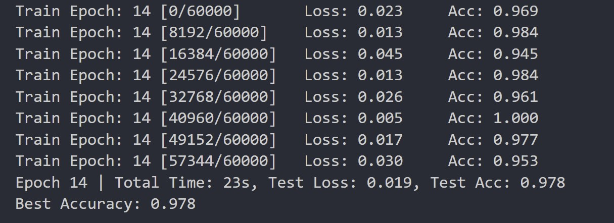
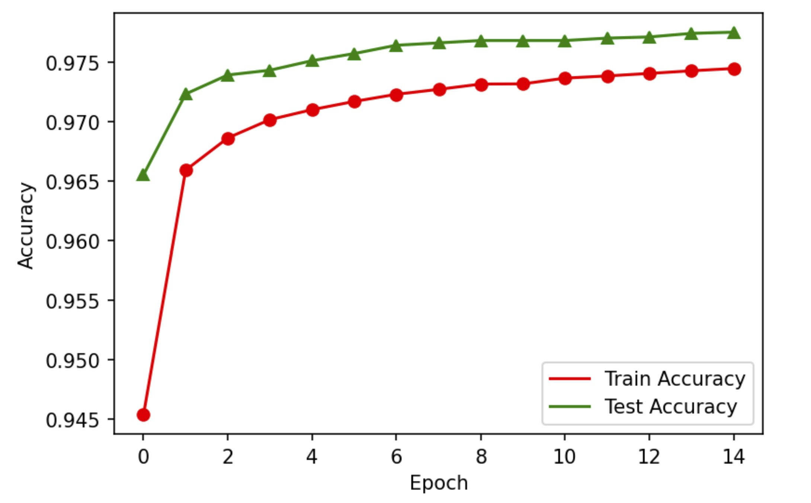
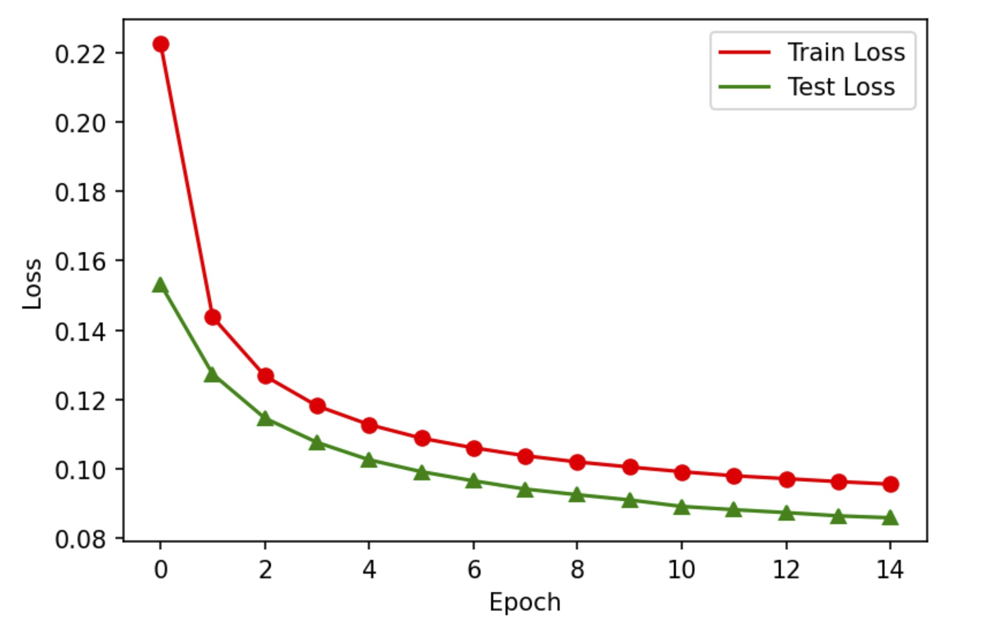

# MNIST Classification with MLP
未央-机械01 金佳熠 2020012933

## Preparation

为了使训练过程顺利进行，在Preparations中做了如下定义：
- Layers: ReLU, Sigmoid, Linear的forward和backward
- Loss Functions: MSELoss, BCELoss, CrossEntropyLoss的forward和backward
- Model: LogisticRegression和TwoLayerNet
- Optimizer: SGD

将此处自定义的Layers和Loss Functions与pytorch中自带的相应功能进行比较，得到结果如下：

由此说明它们的正确性。

## Step 1: Logistic Regression
对逻辑回归模型分别使用MSELoss和BCELoss两个损失函数来训练逻辑回归模型。两次训练中使用相同的超参数设置，如下表所示：

| Hyperparameters | Value | Meaning |
| --------------- | ----- | ------- |
| num_epochs | 15 | training epochs |
| lr | 0.01 | learning rate |
| logging_steps | 64 | logging batchsize |
| best_acc | 0.0 | best accuracy |

### 使用MSELoss损失函数
当使用MSELoss损失函数时，最后一次迭代结果如下图所示：

最后一次迭代中测试集损失为0.019，准确率为97.8%，最终模型的最佳准确率为97.8%.

绘制训练集和测试集上的损失和准确率曲线（为避免曲线噪声过大，对于训练集，
取一个批次内最后的损失和准确率，下同），曲线如下图所示：

### 使用BCELoss损失函数
当使用BCELoss损失函数时，最后一次迭代结果如下图所示：

最后一次迭代中测试集损失为0.019，准确率为97.8%，最终模型的最佳准确率为97.8%.

绘制训练集和测试集上的损失和准确率曲线如下图所示：

### 训练结果对比
对比使用MSELoss和BCELoss损失函数时的训练结果，二者结果一致，最佳准确率均为97.8%，具有较好的训练效果。

通过观察测试集的损失和准确率曲线，发现该模型在前几次迭代便已获得较低的损失和较高的准确率，收敛效果良好，说明这组超参数选择是合理的。

