# MNIST Classification with MLP
未央-机械01 金佳熠 2020012933

## Preparations

为了使训练过程顺利进行，在Preparations中做了如下定义：
- Layers: ReLU, Sigmoid, Linear的forward和backward
- Loss Functions: MSELoss, BCELoss, CrossEntropyLoss的forward和backward
- Model: LogisticRegression和TwoLayerNet
- Optimizer: SGD

将此处自定义的Layers和Loss Functions与pytorch中自带的相应功能进行比较，得到结果如下：


由此说明它们的正确性。

## Step 1: Logistic Regression
对逻辑回归模型分别使用MSELoss和BCELoss两个损失函数来训练。两次训练中使用相同的超参数设置，如下表所示：

| Hyperparameters | Value | Meaning |
| --------------- | ----- | ------- |
| num_epochs | 15 | training epochs |
| lr | 0.01 | learning rate |
| logging_steps | 64 | logging batchsize |

### 使用MSELoss损失函数
当使用MSELoss损失函数时，最后一轮迭代结果如下图所示：


最后一轮迭代中测试集损失为0.019，准确率为97.8%，最终模型的最佳准确率为97.8%.

绘制训练集和测试集上的损失和准确率曲线（为避免曲线噪声过大，对于训练集，
取一个批次内的平均损失和准确率，下同），曲线如下图所示：

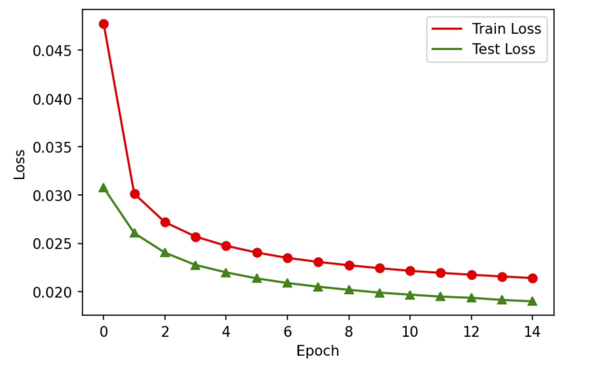


### 使用BCELoss损失函数
当使用BCELoss损失函数时，最后一轮迭代结果如下图所示：


最后一轮迭代中测试集损失为0.086，准确率为97.7%，最终模型的最佳准确率为97.7%.

绘制训练集和测试集上的损失和准确率曲线如下图所示：


### 训练结果对比
对比使用MSELoss和BCELoss损失函数时的训练结果，二者最佳准确率相一致，具有较好的训练效果。

通过观察损失和准确率曲线，发现该模型在前几次迭代便已获得较低的损失和较高的准确率。随着迭代轮数的增加，训练集和测试集的损失递减，准确率递增，且递增/递减的速率减小，收敛效果良好，说明这组超参数选择是合理的。

## Step 2: MLP Classification
使用自定义的TwoLayerNet模型（即具有一个隐层的MLP）完成随机梯度下降优化的多层感知机分类任务。对MLP模型分别使用CrossEntropyLoss和MSELoss损失函数进行训练。两次训练隐藏层均为300维，使用相同的超参数设置，如下表所示：

| Hyperparameters | Value | 
| --------------- | ----- | 
| num_epochs | 15 |
| lr | 0.01 |
| logging_steps | 100 | 

### 使用CrossEntropyLoss损失函数
当使用CrossEntropyLoss损失函数时，最后一轮迭代结果如下图所示：

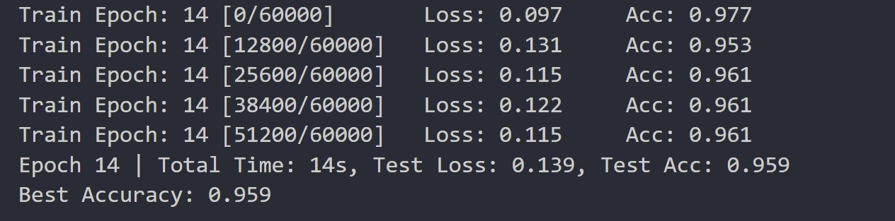

最后一轮迭代中测试集损失为0.139，准确率为95.9%，最终模型的最佳准确率为95.9%.

绘制训练集和测试集上的损失和准确率曲线如下图所示：

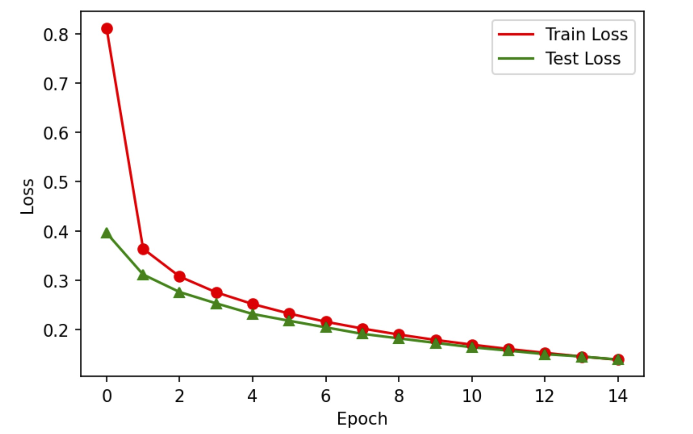


### 使用MSELoss损失函数
在使用MSELoss损失函数时，为使输出层结果outputs与目标结果targets维度一致，需要借助onehot_coding函数对targets进行转换，如在使用CrossEntropyLoss损失函数时，损失的前向传播为

```python
loss = criterion.forward(outputs, targets)
```

而在使用MSELoss损失函数时，损失的前向传播变为

```python
loss = criterion.forward(outputs, onehot_encoding(targets, 10))
```

最后一轮迭代结果如下图所示：

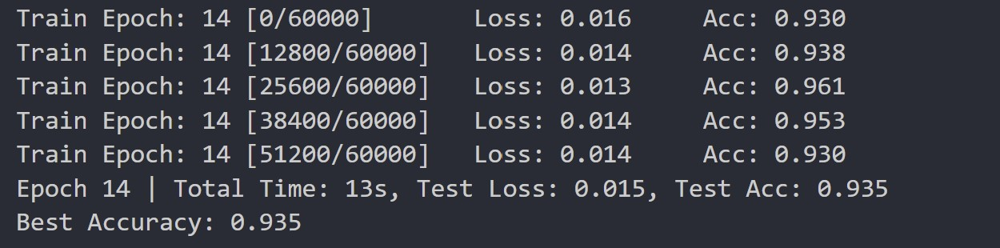

最后一轮迭代中测试集损失为0.015，准确率为93.5%，最终模型的最佳准确率为93.5%.

绘制训练集和测试集上的损失和准确率曲线如下图所示：


### 训练结果对比
对比使用MSELoss和BCELoss损失函数时的训练结果，二者结果较为接近，最佳准确率均在95%左右。相比之下，使用CrossEntropyLoss损失函数获得的最佳准确率高于95%，具有更好的训练效果。

观察两次训练的损失和准确率曲线，均具有较好的收敛性，且随着迭代轮数增加，训练集和测试集上的损失和准确率趋同。

## Step 3: Training with Autograd
在Step 2 的基础上，使用pytorch 内置的计算图和自动微分框架，即torch.autograd 模块，进行梯度的计算。使用CrossEntropyLoss损失函数训练模型，隐层维度及超参数设置与Step 2相同，得到最后一轮迭代结果如下图所示：

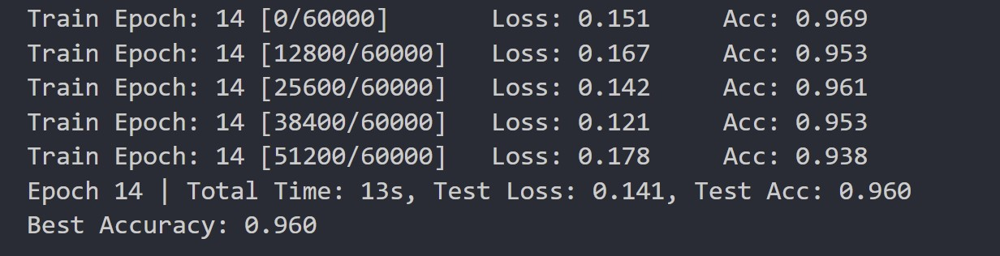

最后一轮迭代中测试集损失为0.141，准确率为96.0%，最终模型的最佳准确率为96.0%，这与Step 2中得到的95.9%是一致的，也从侧面说明Preparations中手动定义的梯度反向传播是正确的。

绘制训练集和测试集上的损失和准确率曲线如下图所示：


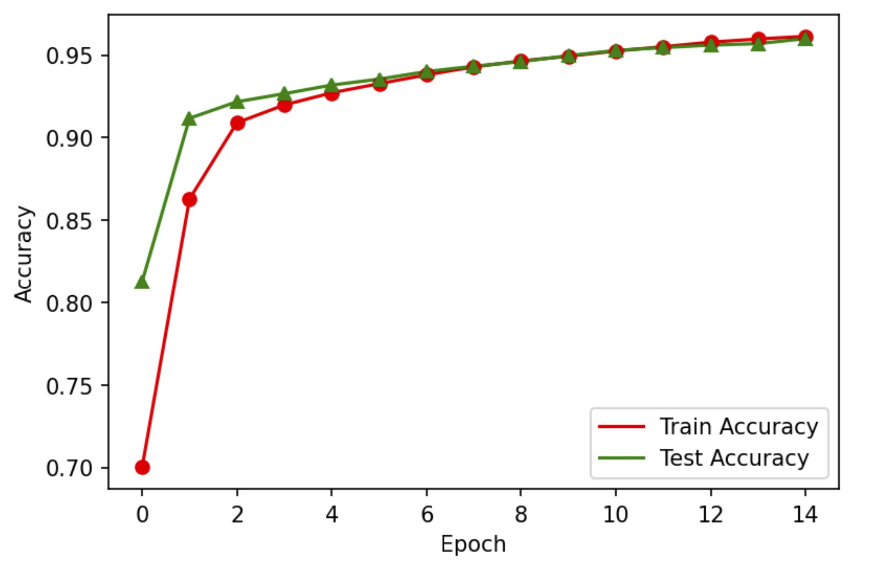

曲线仍具有较好的收敛性，且收敛速度略快于Step 2中的结果。

## Step 4: Training with torch.nn
在Step 3的基础上，使用torch.nn构造更通用的MLP模型，并使用torch.nn 模块中内置的损失函数和优化器进行训练，从而全部替换掉手写的模块。

### 具有1个隐层的MLP
隐层维度及超参数设置与Step 2保持相同，得到最后一轮迭代结果如下图所示：


最后一轮迭代中测试集损失为0.141，准确率为95.8%，最终模型的最佳准确率为95.8%，与Step 2和3的结果均一致。

绘制训练集和测试集上的损失和准确率曲线如下图所示：

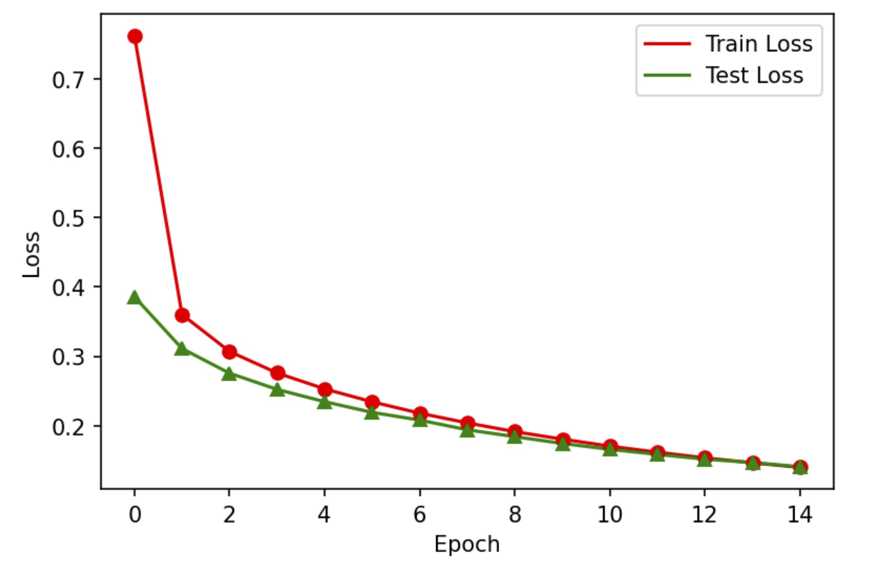


曲线具有较好的收敛性。

### 具有2个隐层的MLP
两个隐层维度分为设置为512和300，超参数设置保持不变，得到最后一轮迭代结果如下图所示：


最后一轮迭代中测试集损失为0.127，准确率为96.2%，最终模型的最佳准确率为96.2%，与单隐层的MLP相比有所提升。

绘制训练集和测试集上的损失和准确率曲线如下图所示：

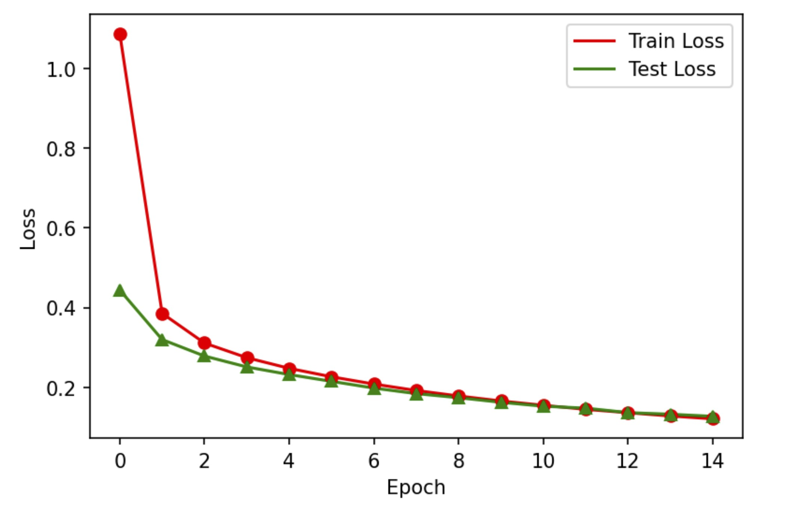

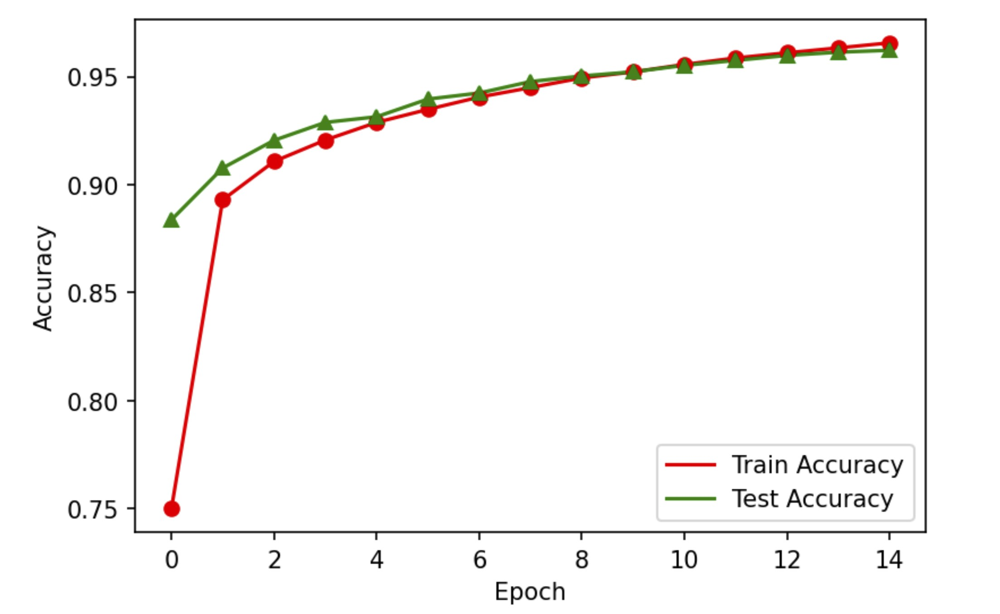

通过调整超参数的值，可以进一步提升双隐层MLP的训练准确率。将迭代轮数增加至25轮，得到最后一轮迭代结果如下图所示：

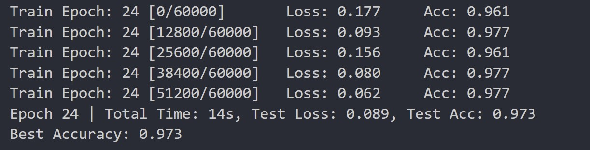

最后一轮迭代中测试集损失为0.089，准确率为97.3%，最终模型的最佳准确率为97.3%，与迭代15次的双隐层MLP相比有所提升。由于模型此时具有较好的收敛性，随着迭代次数增加，模型的准确率会有所上升，但增速逐渐放缓，即如果需要提升同样的准确率，需要的迭代轮数会越多。

绘制训练集和测试集上的损失和准确率曲线如下图所示：


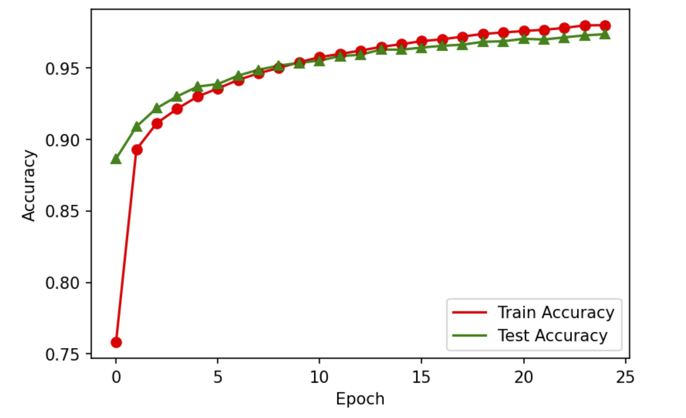

值得注意的是，最后几轮迭代中，模型在训练集上的平均效果要略由于测试集上的效果（即损失更小，准确率更高），出现了过拟合的迹象。尽管此处二者差异并不大，且测试集上仍有较高的准确率，但可以预见的是，如果迭代轮数无限大，很有可能会出现过拟合的情况。