# CNN Classification on CIFAR-100 Dataset
未央-机械01 金佳熠 2020012933

## Step 1: MLP Classification
在本节中，实现了完整的基于Pytorch的MLP代码用于图像分类。通过调整隐层的数量和宽度，计算模型的总参数量，观察模型分类准确率与上述参数的关系。

实验中超参数设置如下：

| Hyperparameters | Value | Meaning |
| --------------- | ----- | ------- |
| num_epochs | 20 | training epochs |
| lr | 0.05 | learning rate |
| batchsize | 256 | training batchsize |
| logging_steps | 100 | logging batchsize |

### 128宽的单隐层MLP
当使用参数为128宽的单隐层MLP时，模型总共有两层，总参数量为406244，经过20轮迭代后，验证集上最佳准确率为22.860%，训练集和验证集上的损失和准确率曲线如下图所示。

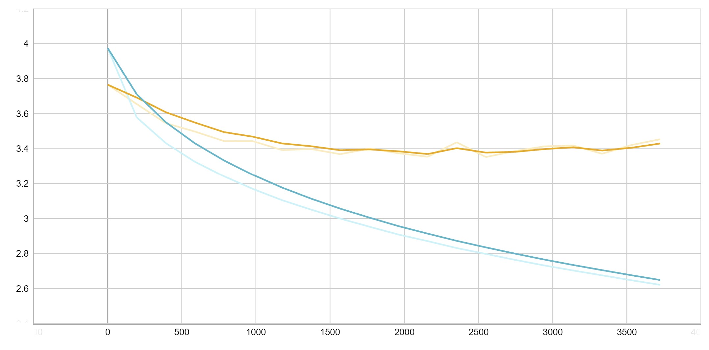
损失曲线（黄线为验证集，蓝线为训练集，下同）

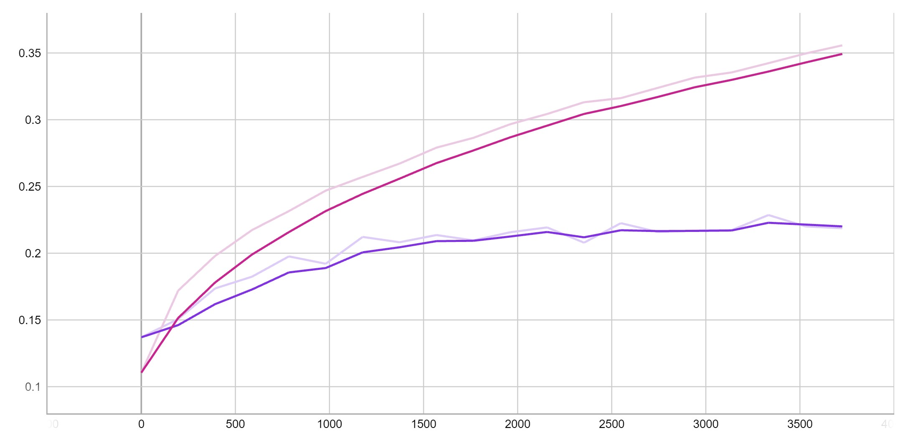
准确率曲线（紫线为验证集，红线为训练集，下同）

### 256宽的单隐层MLP
调整隐层的宽度为256，模型总共有两层，总参数量为812388，经过20轮迭代后，验证集上最佳准确率为23.260%，训练集和验证集上的损失和准确率曲线如下图所示。

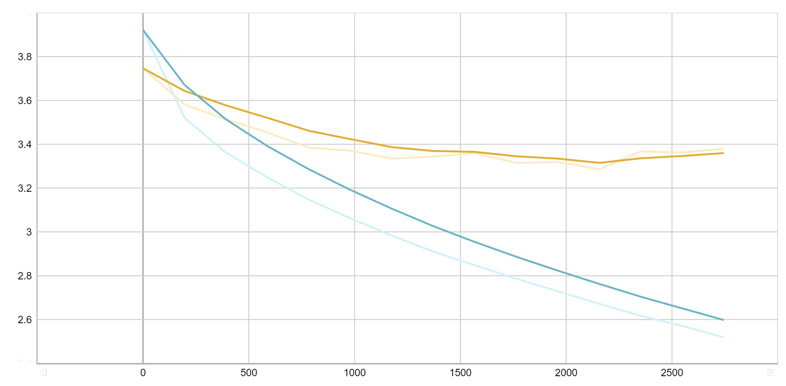
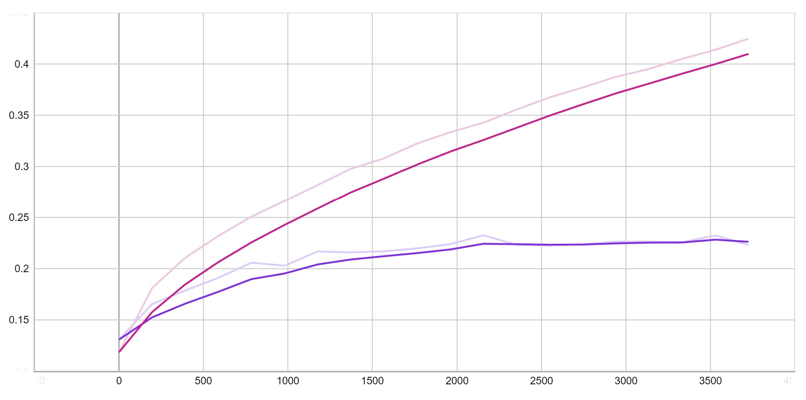

### 256-128宽的双隐层MLP
调整隐层的数量为两层，模型总共有三层，总参数量为832484，经过20轮迭代后，验证集上最佳准确率为24.240%，训练集和验证集上的损失和准确率曲线如下图所示。

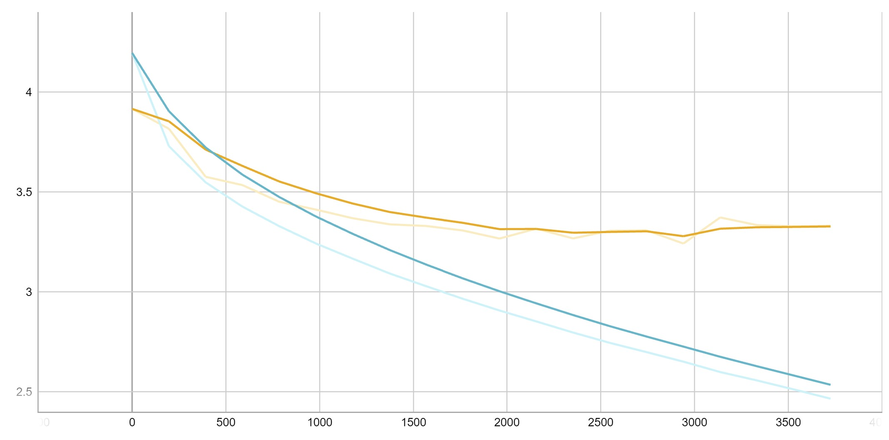
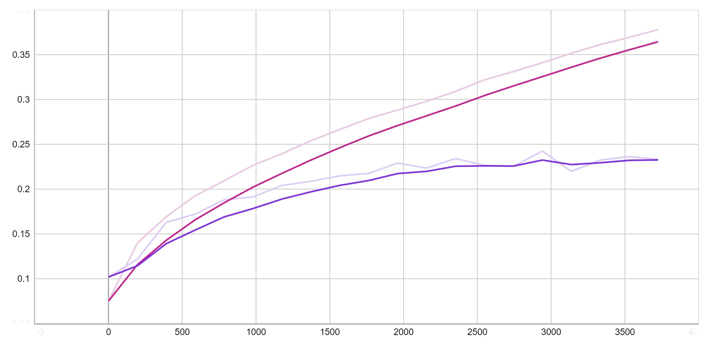

### 512-256宽的双隐层MLP
调整双隐层的宽度为512、256，模型总共有三层，总参数量为1730404，经过20轮迭代后，验证集上最佳准确率为24.620%，训练集和验证集上的损失和准确率曲线如下图所示。

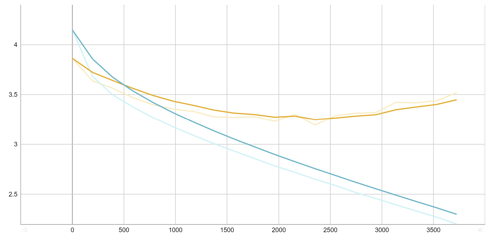
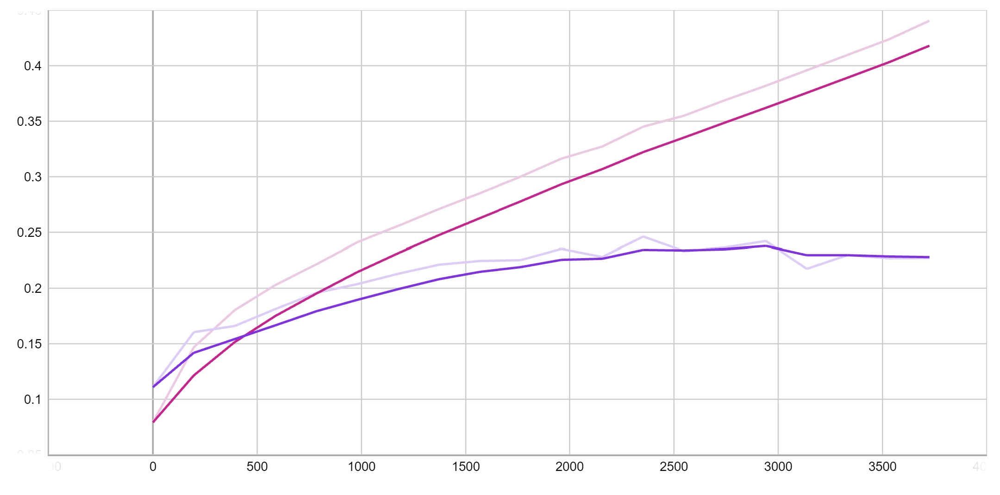

### 对比分析
通过调整隐层的数量和宽度并计算模型总参数量，观察到同层数的模型随着宽度增加，准确率有所上升；层数越多，准确率越高。总的来说，即总参数量越大，模型准确率越高。

整体来说，使用MLP训练CIFAR-100数据集准确率并不高，且训练集与验证集上准确率差异较大，模型泛化能力较差。注意到，随着迭代轮数的增加，验证集上的准确率不升反降，说明模型可能出现过拟合的情况。

## Step 2: CNN Classification
在本节中，使用Pytorch实现一个CNN 网络，并调整CNN的层数和通道（channel）数，观察模型的参数量与最终的测试准确率，并与Step 1中的MLP 进行比较。

调整CNN的层数（number of hidden layers）、通道数（number of channels）、卷积核大小（kernel size）、池化层大小（pooling kernel size），使得分别与Step 1中256-128宽和512-256宽的MLP的参数量基本相同（量级相同）。两个模型均经过20轮迭代后，对比两种模型的准确率。当CNN隐层通道数为[30, 30]，卷积核大小为[2, 1]，池化层大小为[1, 2]时，总参数量与256-128宽MLP相当，令其为CNN2-1；当CNN隐层通道数为[16, 16]，卷积核大小为[2, 1]，池化层大小为[1, 1]时，总参数量与512-256宽MLP相当，令其为CNN2-2。对比结果如下表所示：

|  | 256-128 MLP | CNN2-1 | 512-256 MLP | CNN2-2 |
| ---------- | ----------- | ----- | ----------- | ----- |
| 总层数 | 3 | 3 | 3 | 3 |
| 总参数量 | 832484 | 676420 | 1730404 | 1538180 |
| 最佳准确率 | 24.240% | 28.500% | 24.620% | 26.010% |

CNN2-1和CNN2-2在训练集和验证集上的损失和准确率曲线如下图所示。

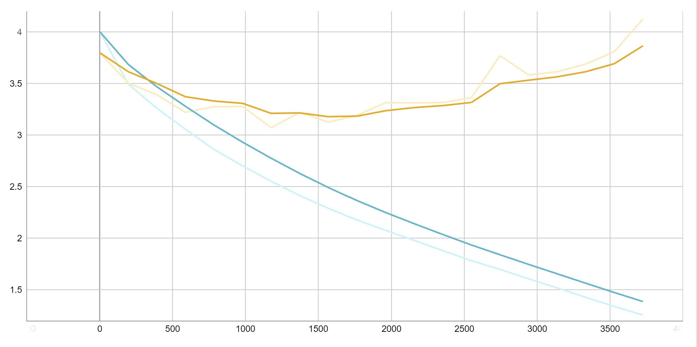
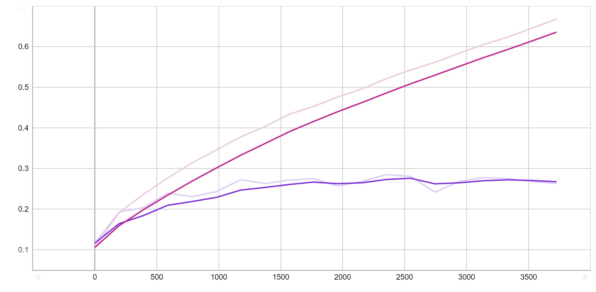
CNN2-1的损失和准确率曲线

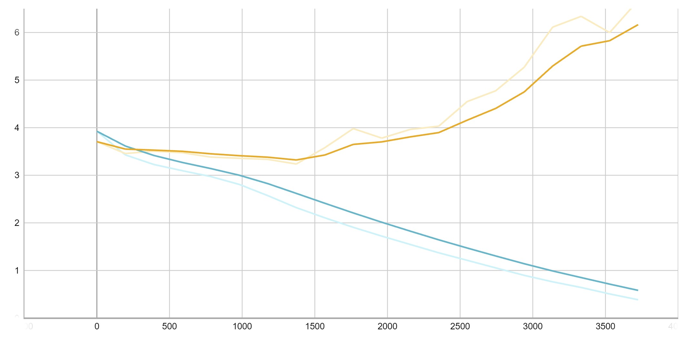
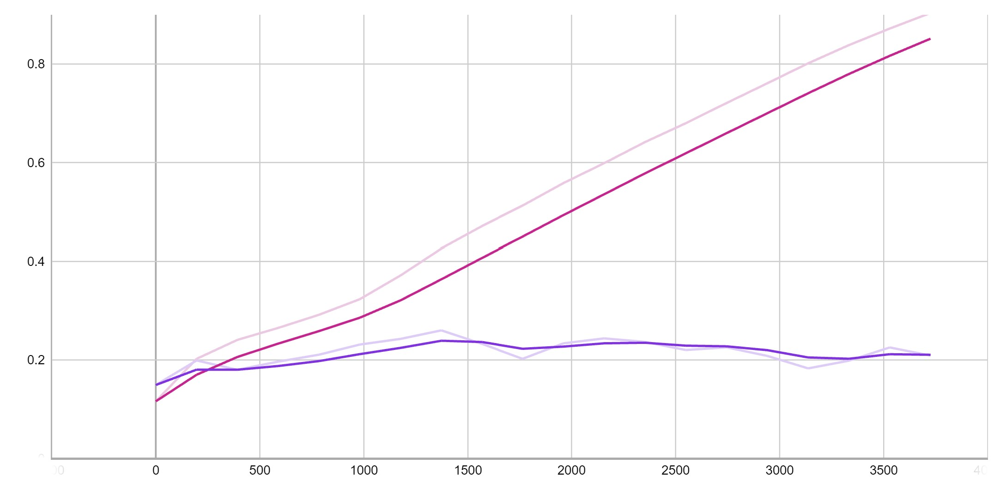
CNN2-2的损失和准确率曲线

由以上模型对比观察到，当CNN和MLP的总参数量相当时，CNN比起MLP有着更高的准确率。但对于CNN来说，并非是总参数量越大就一定有更高的准确率。观察两个CNN的曲线，发现在后一半迭代时训练集和验证集上的差异很大，而且与MLP相比更加严重，说明这组参数的选择并不够合理。

## Step 3: Improvement
本节中将在Step 2的基础上对SGD增加动量（momentum）项与权重衰减（weight
decay），对数据集进行数据增广（data augmentation），观察三种技巧带来的作用。

### Momentum
作为对照的CNN参数为：隐层通道数[16, 16]，卷积核大小[3, 3]，池化层大小[2, 2]，迭代轮数为10轮。对照CNN最佳准确率为27.010%，损失和准确率曲线如下图所示。

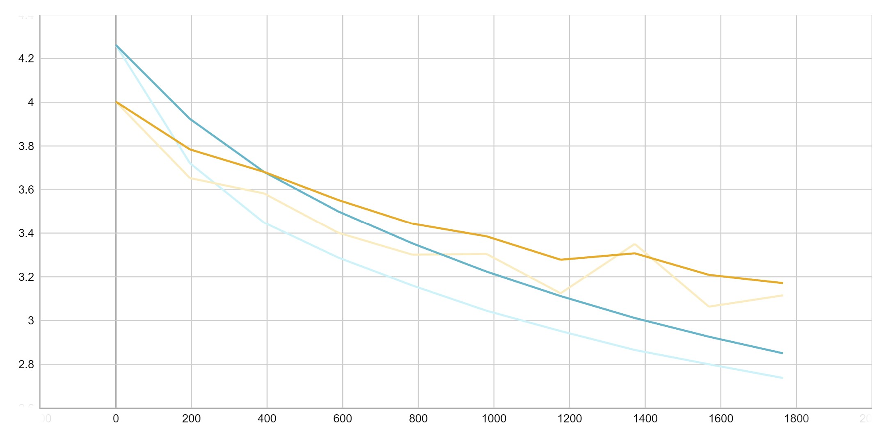
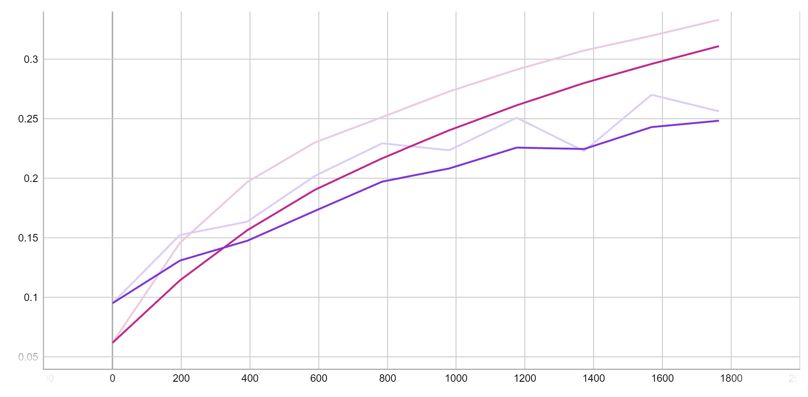

对SGD增加动量项，设置动量参数mmt为0.9，最终模型最佳准确率为31.210%，损失和准确率曲线如下图所示。

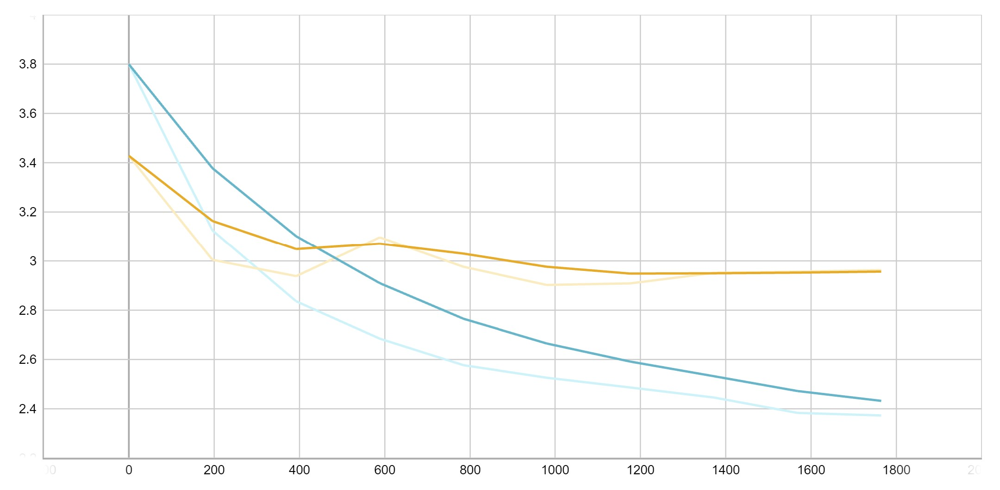
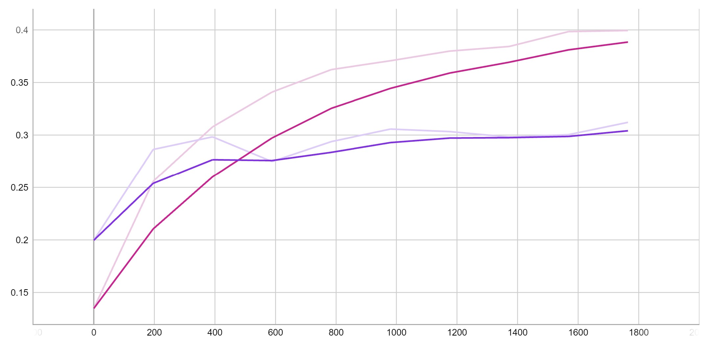

显然，增加了动量项的梯度下降使得模型有了更高的准确率和更快的收敛速度。

在SGD中，我们并不计算损失函数的准确梯度，而是在一个小的batch中进行估计，也就意味着梯度并不总是沿着最优方向下降。引入动量项可以让梯度下降的方向更接近于真实梯度。此外，在局部极小值附近常常会有“沟壑”（“沟壑”处的表面在某一维度上比其他维度上要陡峭的多），这些区域普通SGD可能会发生振荡，而非沿着最有方向下降，动量有助于加速梯度朝着正确方向下降。综合以上两点，带动量的SGD会有更快的收敛速度，这与实验结果是一致的。

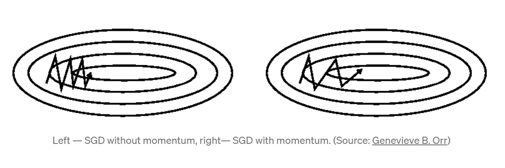

### Weight Decay
权重衰减的作用是减轻模型的过拟合。当模型逐渐过拟合时权值逐渐变大，因此为了避免出现过拟合，会给误差函数添加一个惩罚项。选择过拟合较为明显的Step 2中的CNN2-2作为对照。

对SGD增加权重衰减项，设置权重衰减参数wd为0.001，最终模型最佳准确率为23.190%，损失和准确率曲线如下图所示。

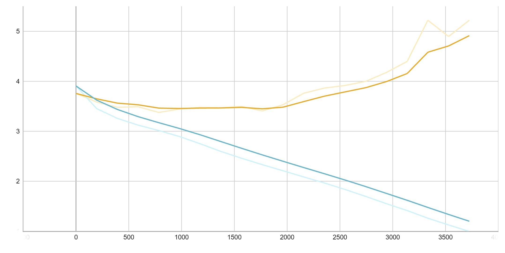
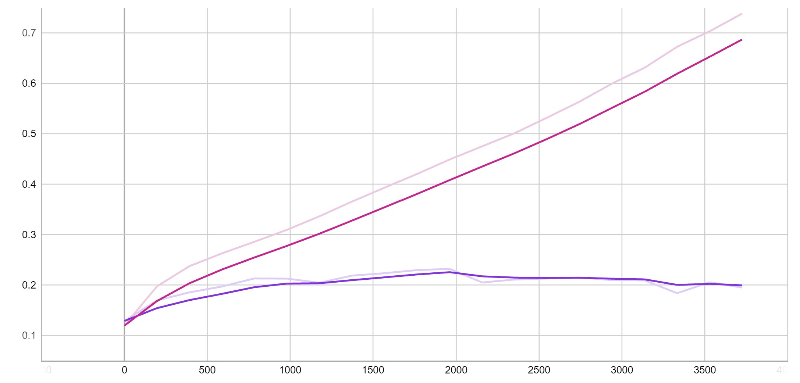

对比CNN2-2的曲线，发现增加权重衰减项后测试集和验证集之间的差距有所缩小，这也验证了权重衰减具有抑制过拟合的作用。

## References
[1] Qian, Ning. "On the momentum term in gradient descent learning algorithms." Neural networks 12.1 (1999): 145-151.

[2] Vitaly Bushaev. “Stochastic Gradient Descent with Momentum.” Medium, Towards Data Science, 4 Dec. 2017, towardsdatascience.com/stochastic-gradient-descent-with-momentum-a84097641a5d. Accessed 9 July 2022.
