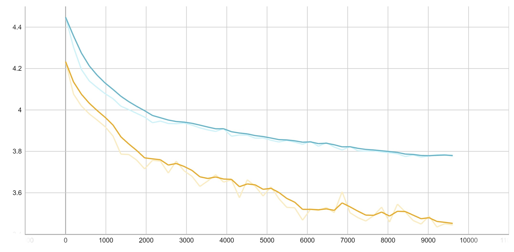
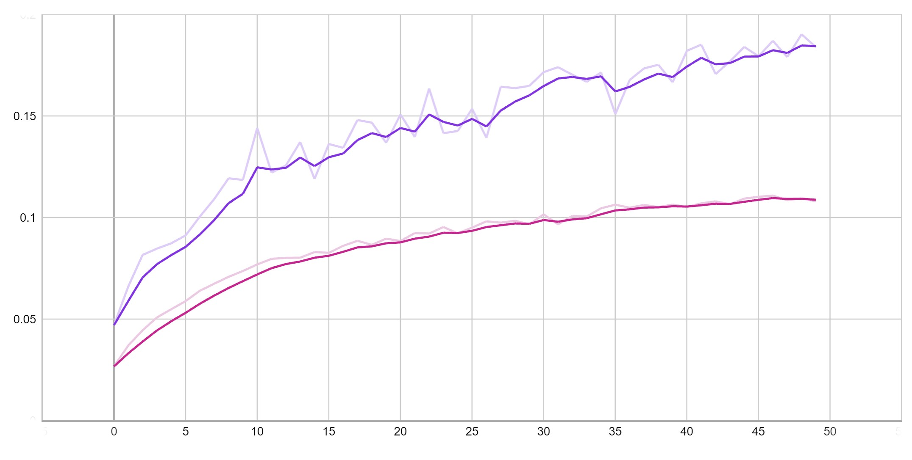
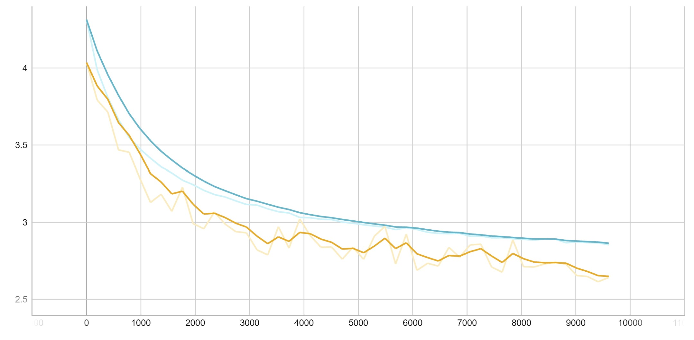
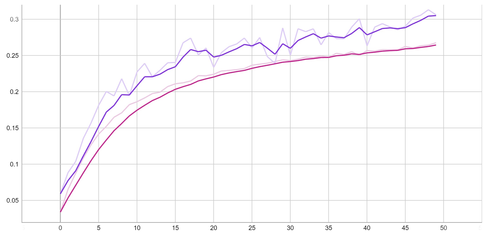

# Deep CNN for Classifications on CIFAR-100 Dataset
未央-机械01 金佳熠 2020012933

## Step 1: Depth of CNN
在本节中通过调整CNN 的深度，观察模型的层数与最终的测试准确率的关系。保持模型超参数设置不变，如下表所示。

| Parameter | Value | Meaning |
| --------- | ------| -------|
| lr | 0.1 | learning rate|
| batchsize | 256 | training batchsize |
| mmt | 0.9 | momentum for optimizer |
| wd | 5e-4 | weight decay for optimizer |
| data_augmentation | True | data augmentation |
| use_BN | True | enable batch normalization |

网络结构上，kernel size每层均为3，pooling stride每层均为2，pooling kernel size在最后十层为1、2相间，其余为1（对于1层和5层CNN，pooling kernel size每层均为2）。在卷积层最后，添加了一个含两个宽度为128的隐层的MLP。保持每层的channel数为32不变，迭代轮数为50轮，观察CNN层数从1、5、10、20、50、75、100 变化时，模型在训练收敛后在训练集和验证集上的准确率的变化。

### 1层CNN
模型最终测试准确率为19.020%，训练集和验证集上的损失和准确率曲线如下图所示。

损失曲线（黄线为验证集，蓝线为训练集，下同）

准确率曲线（紫线为验证集，红线为训练集，下同）

### 5层CNN
模型最终测试准确率为31.310%，训练集和验证集上的损失和准确率曲线如下图所示。

### 10层CNN
模型最终测试准确率为32.860%，训练集和验证集上的损失和准确率曲线如下图所示。

### 20层CNN
模型最终测试准确率为30.120%，训练集和验证集上的损失和准确率曲线如下图所示。

### 50层CNN
模型最终测试准确率为18.050%，训练集和验证集上的损失和准确率曲线如下图所示。

### 100层CNN
模型最终测试准确率为2.390%，训练集和验证集上的损失和准确率曲线如下图所示。

### 对比分析
对比观察1、5、10层的CNN训练后的准确率和损失曲线，发现增加模型的深度能提高模型最终的测试准确率，且模型的泛化能力有所提升。但一味地增加模型的深度也有可能适得其反。当模型深度超过极限深度时，最终的测试准确率不增反减，例如此处50层和100层的CNN训练效果较差，准确率很低，且最后模型出现了过拟合的情况。

## Step 2: ResNet
在本节中，基于给出的ResNet的代码框架进行训练，
